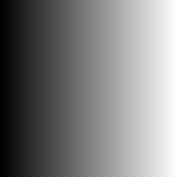

# Random art

Insipired by [Tsoding](https://www.youtube.com/watch?v=3D_h2RE0o0E).
Original paper [here](http://users.ece.cmu.edu/~adrian/projects/validation/validation.pdf).

## Premise

We can create an image by using a function that maps the (x, y) coordinates of the pixel to an (r, g, b) value. If we use the function `f(x, y) -> (x, x, x)` we get a greyscale image:

What if we could generate the functiion `f` randomly, then evaluate it on the (x, y) input !?

