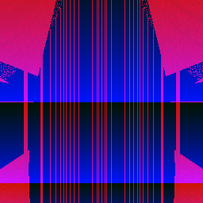

# Random art

    

Insipired by [Tsoding](https://www.youtube.com/watch?v=3D_h2RE0o0E).
Original paper [here](http://users.ece.cmu.edu/~adrian/projects/validation/validation.pdf).

## Premise

We can create an image by using a function that maps the (x, y) coordinates of the pixel to an (r, g, b) value. If we use the function `f(x, y) -> (x, x, x)` we get a greyscale image:

What if we could generate the functiion `f` randomly, then evaluate it on the (x, y) input !?

In the context of security, we can use for example an SSH key hash as the seed for RNG before generating the function, in effect, visualising the hash. 

## Some of my favourite images

These were generated by letting the grammar generate a function to a certain depth.

| Depth3 | Depth 6 | Depth 1 |
|--------|--------|-------|
|  |  |  |
|  |  |  |
|  |  |  |

Going to a higher depth increases the odds of generating a more complex function. The logo was generated with depth = 10, using an AST with 1264 nodes! 

All the images so far use this grammar given in the paper:

## Extending the grammar

- [x] `ifgeq-then-else`
- [x] `mod`
- [x] `div`
- [ ] `sin`
- [ ] `cos`
- [ ] `exp`

These are some images produces from ASTs that implement these operators:

| Depth 2 | Depth 5 | Depth 13 |
|--------|--------|-------|
|  |  |  |
| `E(y,add(x, x) >= div(y, y),y)` | Function too big to show here | Function too big to show here |

## Todo
- [ ] Rewrite the grammar representation. Currently does function calls, but this isn't really scalable. Adding more constructs becomes rather tedious.
- [ ] Exploration

**Note:** Nesting depth is currently limited to 8. Higher numbers cause weird issues, but we don't need massive functions anyway. They may noy actually be that useful.
