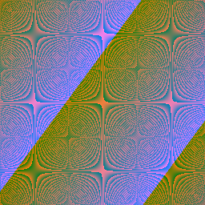
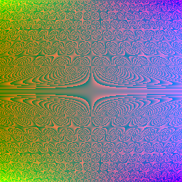
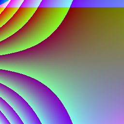

# Random art

<p align="center" width="100%">
    

Insipired by [Tsoding](https://www.youtube.com/watch?v=3D_h2RE0o0E).
Original paper [here](http://users.ece.cmu.edu/~adrian/projects/validation/validation.pdf).

## Premise

We can create an image by using a function that maps the (x, y) coordinates of the pixel to an (r, g, b) value. If we use the function `f(x, y) -> (x, x, x)` we get a greyscale image:


x and y are mapped to [-1, 1]. The results from the function are then scaled to map to [0,255] for each channel.

What if we could generate the functiion `f` randomly, then evaluate it on the (x, y) input !?

In the context of security, we can use for example an SSH key hash as the seed for RNG before generating the function, in effect, visualising the hash. 

## Some of my favourite images

These were generated by letting the grammar generate a function to a certain depth.

| Depth3 | Depth 6 | Depth 1 | Depth 4 |
|--------|--------|-------|-------|
|  |  |  |  |
|  |  |  |  |
|  |  |  |  |


All the images so far use this grammar given in the paper:


## Extending the grammar

- [x] `ifgeq-then-else`
- [x] `mod`
- [x] `div`
- [x] `sin`
- [x] `cos`
- [x] `exp`

There's code to interpret these additional constructs, so it is possible to write ASTs by hand that use them. They haven't been added to the grammar. The grammar should be easily extendable, for example, the paper grammar is represented like so:

```C
void grammar(){

    init_rules(N_RULES);

    init_branches(R_E, MAX_BRANCHES); // allocate memory for branches
    init_branches(R_A, MAX_BRANCHES); // allocate memory for branches
    init_branches(R_C, MAX_BRANCHES); // allocate memory for branches

    g.entry_point = g.rule + R_E;

    assert(g.entry_point != NULL); // entry point must be defined

    add_branch_to_rule(R_E, branch_triple_rule(R_C, R_C, R_C, NK_E, 1.0));

    add_branch_to_rule(R_A, branch_no_rule(NK_NUMBER, 1.0/3.0));
    add_branch_to_rule(R_A, branch_no_rule(NK_X, 1.0/3.0));
    add_branch_to_rule(R_A, branch_no_rule(NK_Y, 1.0/3.0));

    add_branch_to_rule(R_C, branch_single_rule(R_A, 1.0/3.0));
    add_branch_to_rule(R_C, branch_double_rule(R_C, R_C, NK_ADD, 3.0/8.0));
    add_branch_to_rule(R_C, branch_double_rule(R_C, R_C, NK_MULT, 3.0/8.0));
}
```

These are some images produces from ASTs that implement these operators:

| Depth 2 | Depth 5 | Depth 13 |
|--------|--------|-------|
|  |  |  |
| `E(y,add(x, x) >= div(y, y),y)` | Function too big to show here | Function too big to show here |

## Todo
- [ ] Exploration

## Running
`./randomart` will start the program, prompting you for an input. Using a series of commands controls what it does. 

By default, the program rendersn image from a randomly generated AST at depth 1. Typing enter runs with this default configuration:

```
$ ./randomart 
GRAMMAR: 
E ::= (C,C,C) [1.000000]
A ::= random number [-1 1] [0.333333] | x [0.333333] | y [0.333333]
C ::= A [0.100000] | add(C, C) [0.300000] | div(C, C) [0.300000] | sin(C) [0.300000]

> 
E(x,x,x)
nodes in AST: 4

Rendering image.....

> 
```

You can also type in a function which will be parsed and interpreted:
```
$ ./randomart 
GRAMMAR: 
E ::= (C,C,C) [1.000000]
A ::= random number [-1 1] [0.333333] | x [0.333333] | y [0.333333]
C ::= A [0.100000] | add(C, C) [0.300000] | div(C, C) [0.300000] | sin(C) [0.300000]

> E(sin(0.3), add(x,y), y)
Rendering image.....

> 
```
- `depth n` sets the depth
- `seed n` sets the seed
- `quit` quits the program

### Note: 
- Nesting depth is currently limited to 50. 
